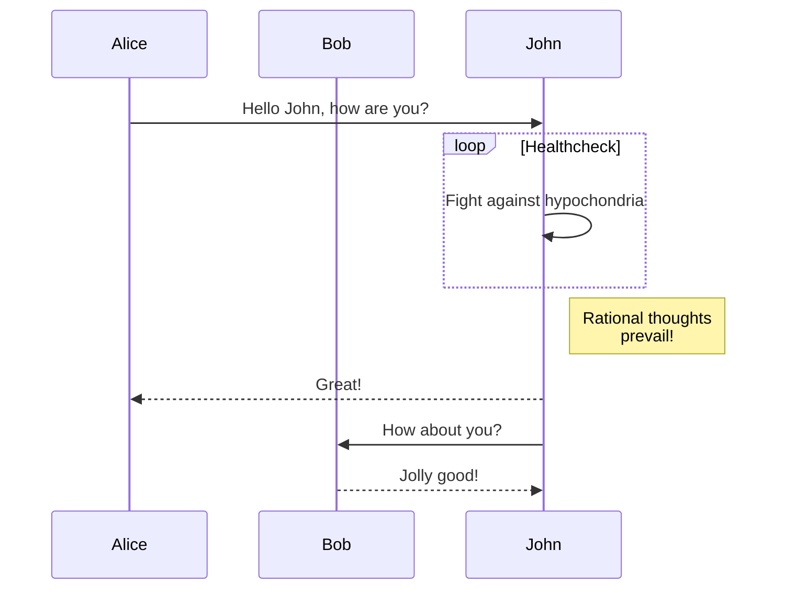
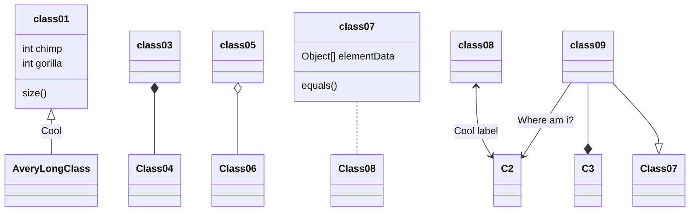
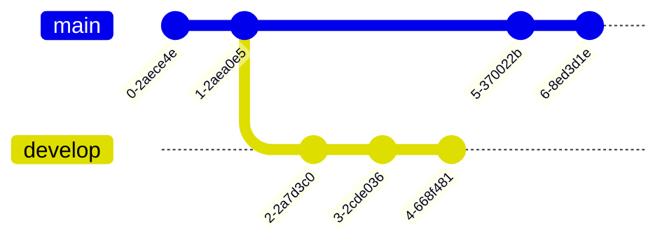

# gittest
## intro
<<<<<<< HEAD
testrepo för git-kursen hos Nexer kasdkoaskdkoasokdasdkasdetst
=======
testrepo för git-kursen hos Nexer kasdkoaskdkoasokd testing
>>>>>>> remotes/origin/main

## body
Det är alltid svårt att lista ut vad man ska skriva för att fylla utrymme. Man vill ju inte vara tråkig och köra på lorem ipsum liksom, lite mer kreativ får man vara. Med den inställningen blir det dock bara en rant om att man inte kan lista ut vad man ska skriva. Teständring #2

# Sample Mermaid diagrams, for more details:
https://docs.github.com/en/get-started/writing-on-github/working-with-advanced-formatting/creating-diagrams

	
	
	

